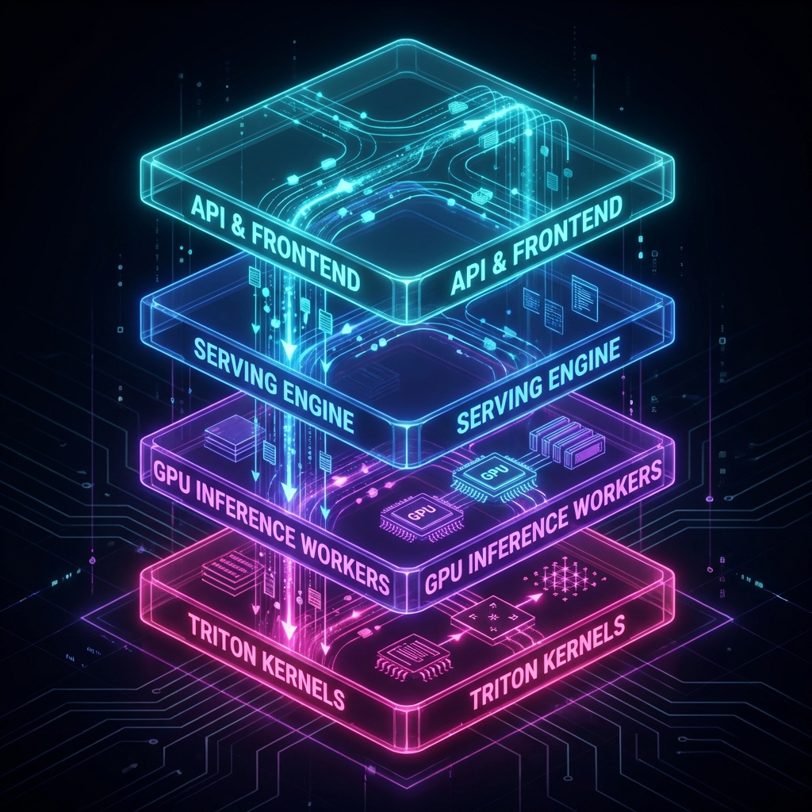
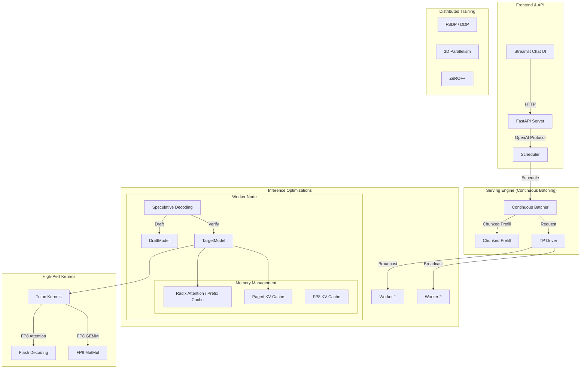

# 🚀 GPU Optimization Toolkit

[](https://www.python.org/downloads/)
[](https://pytorch.org/)
[](https://developer.nvidia.com/cuda-toolkit)
[](https://opensource.org/licenses/MIT)

> **Production-ready GPU optimization toolkit for the complete ML lifecycle: Pre-Training → Post-Training → Inference → Evaluation**

```
┌─────────────────────────────────────────────────────────────────────────────┐
│  🎯 Train 70B models on 24GB GPU  │  ⚡ 3x faster inference  │  📉 4x memory │
└─────────────────────────────────────────────────────────────────────────────┘
```

---

## 📊 Performance at a Glance

| Optimization | Speedup | Memory | Best For |
|:-------------|:-------:|:------:|:---------|
| **DDP/FSDP** | Linear scaling | 3× reduction | Multi-GPU training |
| **torch.compile** | 1.5-2× | - | Any PyTorch model |
| **Mixed Precision (AMP)** | 2× | 50% less | Training |
| **LoRA/QLoRA** | - | 99.9% fewer params | Fine-tuning 70B+ |
| **GaLore** | - | 4× savings | Full-param training |
| **NEFTune** | - | - | +5-10% instruction following |
| **ORPO/SimPO** | - | 50% (no ref model) | Preference tuning |
| **Model Merging** | - | - | Combine model capabilities |
| **Speculative Decoding** | 2-3× | - | LLM inference |
| **GPTQ/AWQ (4-bit)** | - | 4× reduction | Production serving |

---

## 🚀 Quick Start

### Installation

```bash
git clone https://github.com/your-org/gpu_optimize_demo.git
cd gpu_optimize_demo
pip install -e ".[all]"
```

### 30-Second Examples

```python
# ═══════════════════════════════════════════════════════════════════════════
# 🔥 DISTRIBUTED TRAINING — Train on multiple GPUs
# ═══════════════════════════════════════════════════════════════════════════

from src.training import DDPWrapper, DDPConfig, setup_distributed

setup_distributed()  # Initialize distributed environment

# DDP: Simple multi-GPU (model fits in single GPU)
wrapper = DDPWrapper(DDPConfig(mixed_precision=True, precision="bf16"))
model = wrapper.wrap(model)

for batch in dataloader:
    with wrapper.autocast():
        loss = model(batch)
    wrapper.backward(loss, optimizer, model)

# FSDP: Large models (7B+ parameters)
from src.training import FSDPWrapper, FSDPConfig
fsdp_model = FSDPWrapper(FSDPConfig(sharding_strategy="full_shard")).wrap(model)

# ═══════════════════════════════════════════════════════════════════════════
# 🎯 FINE-TUNING — Train 70B on single 24GB GPU
# ═══════════════════════════════════════════════════════════════════════════

from src.post_training import apply_lora, LoRAConfig

config = LoRAConfig(r=16, target_modules=["q_proj", "v_proj"])
model = apply_lora(model, config)  # Only 0.1% parameters trainable!

# ═══════════════════════════════════════════════════════════════════════════
# ⚡ INFERENCE — 3x faster generation
# ═══════════════════════════════════════════════════════════════════════════

from src.inference import SpeculativeDecoder, quantize_model, QuantizationConfig

# Speculative Decoding: 2-3x speedup
decoder = SpeculativeDecoder(llama_70b, llama_7b)
output = decoder.generate(input_ids)

# 4-bit Quantization: 4x memory reduction
model = quantize_model(model, QuantizationConfig(bits=4, method="gptq"))

# ═══════════════════════════════════════════════════════════════════════════
# 🌐 HIGH-THROUGHPUT SERVING — Continuous Batching + FP8
# ═══════════════════════════════════════════════════════════════════════════

from src.serving import create_server
from src.inference import FP8KVCache, ChunkedPrefillScheduler

# Launch OpenAI-compatible server with optimizations
# - Continuous Batching: Interleave decode/prefill
# - FP8 Cache: 2x KV capacity
# - TP: 2-GPU Tensor Parallelism
create_server(
    model_path="TinyLlama/TinyLlama-1.1B-Chat-v1.0",
    tp_size=2
)
```

---

## 🏗️ Architecture

<div align="center">
  
</div>

### Detailed Flow



### Component Details

| Layer | Component | Key Features |
|-------|-----------|--------------|
| **Serving** | **OpenAI Server** | FastAPI, SSE Streaming, Async Architecture |
| **Scheduling** | **Continuous Batcher** | Dynamic Batching, Chunked Prefill (Split-wise), Priority Queues |
| **Inference** | **Speculative Decoding** | Draft/Verify Logic, Eagle/Medusa support ready |
| **Memory** | **Advanced KV Cache** | **Radix Attention** (Prefix Caching), **FP8 Compression**, Paged Allocation |
| **Distributed** | **Tensor Parallel** | SPMD Worker Architecture, Distributed Broadcast |
| **Kernels** | **Triton Kernels** | **FP8 Flash Decoding**, FlashInfer Integration, Custom Fused Ops |
| **Training** | **Advanced Training** | **3D Parallelism** (TP+SP+PP), **ZeRO++** (Quantized Comm), Flash Attn v3 |


<details>
<summary>📝 Text version (for accessibility)</summary>

```
PRE-TRAINING: torch.compile → AMP (FP16/BF16) → DDP/FSDP → Memory Pool → Gradient Checkpointing
      ↓
POST-TRAINING:
  ├─ PEFT: LoRA/QLoRA, AdaLoRA, VeRA, GaLore
  ├─ Alignment: NEFTune, ORPO/SimPO, DPO/RLHF
  └─ Advanced: Model Merging (TIES/DARE), Continual Learning (EWC)
      ↓
INFERENCE: Speculative Decoding → KV-Cache → Quantization (GPTQ/AWQ) → Continuous Batching
      ↓
SERVING & EVALUATION: SGLang Server → Benchmarks (MMLU) → Safety → Metrics → Latency Monitoring
```
</details>

---

## 📦 Core Modules

### 1️⃣ Distributed Training (DDP / FSDP)

Choose the right strategy for your model:

| Model Size | Strategy | Memory Savings | Use Case |
|:-----------|:---------|:--------------:|:---------|
| < 7B | **DDP** | 1× (no sharding) | Simple multi-GPU |
| 7B - 70B | **FSDP** | ~3× | Single-node multi-GPU |
| > 70B | **DeepSpeed** | ~8×+ | Multi-node + CPU offload |

<details>
<summary><b>📖 DDP — Distributed Data Parallel</b></summary>

```python
from src.training import DDPWrapper, DDPConfig, setup_distributed, cleanup_distributed

# Initialize
setup_distributed()

# Configure DDP
config = DDPConfig(
    mixed_precision=True,           # Enable AMP
    precision="bf16",               # BF16 more stable than FP16
    gradient_clipping=1.0,          # Prevent exploding gradients
    gradient_accumulation_steps=4,  # Effective batch = 4 × batch_size
    static_graph=True,              # Faster for fixed architectures
)

# Wrap model
wrapper = DDPWrapper(config)
model = wrapper.wrap(model)
optimizer = torch.optim.AdamW(model.parameters(), lr=1e-4)

# Training loop
for epoch in range(num_epochs):
    for batch in dataloader:
        with wrapper.autocast():
            loss = model(batch)
        wrapper.backward(loss, optimizer, model)  # Handles scaling & clipping

# Save checkpoint (rank 0 only)
wrapper.save_checkpoint(model, optimizer, epoch, "checkpoint.pt")

cleanup_distributed()
```

**Run:**
```bash
torchrun --nproc_per_node=4 train.py
```
</details>

<details>
<summary><b>📖 FSDP — Fully Sharded Data Parallel</b></summary>

```python
from src.training import FSDPWrapper, FSDPConfig, DistributedTrainer

# FSDP shards parameters, gradients, and optimizer states across GPUs
config = FSDPConfig(
    sharding_strategy="full_shard",   # Maximum memory savings (~3×)
    mixed_precision=True,
    precision="bf16",
    activation_checkpointing=True,    # Further 40-60% memory savings
    auto_wrap_policy="transformer",   # Auto-wrap transformer blocks
    cpu_offload=False,                # Enable for extreme memory pressure
)

# Wrap model
wrapper = FSDPWrapper(config)
model = wrapper.wrap(model)

# Or use the unified trainer
trainer = DistributedTrainer(model, DistributedTrainerConfig(strategy="fsdp"))
```

**Run:**
```bash
torchrun --nproc_per_node=8 train.py  # 8 GPUs
```
</details>

<details>
<summary><b>📖 Auto Strategy Selection</b></summary>

```python
from src.training import auto_select_strategy, estimate_memory_usage

# Estimate memory requirements
estimates = estimate_memory_usage(model, batch_size=8)
print(f"Total memory needed: {estimates['total_gb']:.1f} GB")

# Auto-select best strategy
strategy = auto_select_strategy(
    model,
    available_gpus=torch.cuda.device_count(),
    gpu_memory_gb=24.0,
)
print(f"Recommended strategy: {strategy}")  # "ddp", "fsdp", or "deepspeed"
```
</details>

---

### 2️⃣ Training Optimization

<details>
<summary><b>🔧 torch.compile & CUDA Graphs</b></summary>

```python
from src.compile import compile_model, CUDAGraphWrapper

# torch.compile — 30-200% speedup with one line
model = compile_model(model, mode="max-autotune")

# CUDA Graphs — 10-30% latency reduction for inference
wrapper = CUDAGraphWrapper(model, example_input)
output = wrapper(input)  # Graph replay
```
</details>


<details>
<summary><b>📉 Mixed Precision (AMP)</b></summary>

```python
from src.training import AMPTrainer, AMPConfig

config = AMPConfig(dtype="bfloat16", enabled=True)
trainer = AMPTrainer(config)

for batch in dataloader:
    with trainer.autocast():
        loss = model(batch)
    trainer.backward(loss)
    trainer.step(optimizer)
```
</details>

<details>
<summary><b>⚡ Flash Attention (v2/v3)</b></summary>

```python
from src.training import FlashAttention, FlashAttentionConfig

# Drop-in replacement with 2-3x speedup and O(N) memory
config = FlashAttentionConfig(
    use_flash_attn=True,
    version="v3"  # or "auto"
)
attn_layer = FlashAttention(config, hidden_size=4096)
```
</details>

<details>
<summary><b>📦 Gradient Compression</b></summary>

```python
from src.training import create_gradient_compressor

# Reduce communication bandwidth by 10-100x
compressor = create_gradient_compressor(
    method="topk",  # "topk", "random", "quantize", "powersgd"
    ratio=0.01      # Keep top 1% gradients
)

# In training loop:
grad = compressor.compress_and_allreduce(param.grad)
```
</details>

<details>
<summary><b>🚀 Optimized DataLoader</b></summary>

```python
from src.training import create_prefetched_loader, DataLoaderConfig

# Prefetch data to GPU asynchronously (overlaps I/O with compute)
config = DataLoaderConfig(
    batch_size=64,
    prefetch_factor=4,
    persistent_workers=True
)
loader = create_prefetched_loader(dataset, config, device='cuda')

for batch in loader:
    # batch is already on GPU!
    output = model(batch)
```
</details>

<details>
<summary><b>🔥 Fused Operations</b></summary>

```python
from src.training import FusedAdamW, FusedLayerNorm, FusedSwiGLU

# Faster kernels with lower memory bandwidth usage
optimizer = FusedAdamW(model.parameters(), lr=1e-4)
norm = FusedLayerNorm(4096)
mlp = FusedSwiGLU(4096, 11008)
```
</details>

<details>
<summary><b>💾 Memory Optimization</b></summary>

```python
from src.memory import MemoryPool, CPUOffloader, MemoryProfiler

# Memory Pool — Reuse tensor allocations
pool = MemoryPool()
tensor = pool.allocate((1024, 768), dtype=torch.float16)

# CPU Offload — 2× model capacity
offloader = CPUOffloader(model, optimizer)

# Profiling
profiler = MemoryProfiler()
profiler.snapshot("before")
output = model(x)
profiler.snapshot("after")
print(profiler.delta("before", "after"))
```
</details>

---
### 3️⃣ Post-Training (PEFT & Alignment)

<details>
<summary><b>🎯 LoRA / QLoRA / Advanced Variants</b></summary>

```python
from src.post_training import LoRAModel, LoRAConfig, merge_lora

# LoRA reduces trainable params by 10,000×
config = LoRAConfig(
    r=16,                              # Rank
    alpha=32,                          # Scaling factor
    target_modules=["q_proj", "k_proj", "v_proj", "o_proj"],
    dropout=0.05,
)
model = LoRAModel(base_model, config)
model.print_trainable_params()  # "Trainable: 4,194,304 (0.01%)"

# Merge for deployment (zero overhead inference)
merged_model = merge_lora(model)
```

**Advanced Variants:**
```python
from src.post_training import (
    VeRALayer,        # 10× fewer params than LoRA
    AdaLoRATrainer,   # Adaptive rank allocation
    LoRAXSLayer,      # Ultra-low rank (r=1-2)
    create_lora_plus_optimizer,  # Different lr for A/B matrices
)

# VeRA: Shared random projections (most parameter efficient)
vera_layer = VeRALayer(base_linear, r=256)

# LoRA+: 16× higher lr for B matrix → faster convergence
optimizer = create_lora_plus_optimizer(model, lr=1e-4, lr_ratio=16.0)
```
</details>

<details>
<summary><b>🤝 ORPO / SimPO — No Reference Model Needed</b></summary>

```python
from src.post_training import ORPOTrainer, SimPOTrainer, ORPOConfig, SimPOConfig

# ORPO: Combines SFT + preference in single objective
orpo = ORPOTrainer(model, ORPOConfig(lambda_orpo=0.1))
for batch in data:
    stats = orpo.step(batch["chosen"], batch["rejected"])

# SimPO: Length-normalized, no reference model
simpo = SimPOTrainer(model, SimPOConfig(beta=2.0, gamma=0.5))
```

**When to use:**
| Method | Reference Model | Best For |
|:-------|:---------------:|:---------|
| DPO | ✅ Required | Standard preference tuning |
| ORPO | ❌ Not needed | Combined SFT + preference |
| SimPO | ❌ Not needed | High-quality preference data |
| IPO | ✅ Required | Noisy preference data |
</details>

<details>
<summary><b>📉 GaLore — Full-Parameter Training with LoRA Memory</b></summary>

```python
from src.post_training import create_galore_optimizer, estimate_galore_memory_savings

# Estimate savings
savings = estimate_galore_memory_savings(model, rank=128)
print(f"Memory Savings: {savings['memory_savings_ratio']:.1f}x")

# Create optimizer with gradient projection
optimizer = create_galore_optimizer(
    model,
    lr=1e-4,
    rank=128,                    # Projection rank
    update_proj_gap=200,         # Steps between projection updates
    target_modules=["q_proj", "k_proj", "v_proj"],
)
```

**GaLore vs LoRA:**
- LoRA freezes base model, adds low-rank adapters
- GaLore trains full model but projects gradients to low-rank
- Result: Full model updates with LoRA-level memory
</details>

<details>
<summary><b>🔊 NEFTune — Noisy Embeddings</b></summary>

```python
from src.post_training import apply_neftune

# Simple: Add noise to embeddings during training
# Improves instruction following by 5-10%
trainer = apply_neftune(model, noise_alpha=5.0)

# Training loop (noise automatically added)
for batch in dataloader:
    loss = model(batch)
    loss.backward()
    optimizer.step()

# Disable for evaluation
trainer.disable()
```
</details>

<details>
<summary><b>🔀 Model Merging (TIES, DARE, SLERP)</b></summary>

```python
from src.post_training import ModelMerger, ties_merge, dare_merge, slerp_merge

# SLERP: Smooth interpolation between two models
merged = slerp_merge(model_a, model_b, t=0.5)

# TIES: Prune conflicts, keep important deltas
merged = ties_merge(base_model, [model_a, model_b], threshold=0.2)

# DARE: Randomly drop 90% of deltas → surprisingly effective
merged = dare_merge(base_model, [model_a, model_b], drop_rate=0.9)

# Full control
merger = ModelMerger(base_model)
merged = merger.merge_models(
    [model_a, model_b, model_c],
    config=MergeConfig(method="ties", weights=[0.5, 0.3, 0.2]),
)
```
</details>

<details>
<summary><b>📚 Continual Learning (Anti-Forgetting)</b></summary>

```python
from src.post_training import EWCRegularizer, ReplayBuffer, ContinualLearner

# EWC: Elastic Weight Consolidation
ewc = EWCRegularizer(model, lambda_=1000.0)
# Train task 1...
ewc.compute_fisher(task1_dataloader)
ewc.consolidate()

# Train task 2 with EWC penalty
for batch in task2_dataloader:
    loss = criterion(model(batch)) + ewc.penalty()
    loss.backward()

# Replay Buffer: Mix old samples with new
buffer = ReplayBuffer(max_size=10000)
buffer.add(task1_samples)
replay = buffer.sample(batch_size=32)  # Mix with task2
```
</details>

---

### 4️⃣ Inference Optimization

<details>
<summary><b>⚡ Speculative Decoding</b></summary>

```python
from src.inference import SpeculativeDecoder, SpeculativeConfig

# Use small draft model to propose, large model to verify
decoder = SpeculativeDecoder(
    target_model=llama_70b,
    draft_model=llama_7b,
    config=SpeculativeConfig(num_speculative_tokens=5),
)

output = decoder.generate(input_ids, max_new_tokens=256)
decoder.print_stats()
# Accept rate: 78%
# Speedup: 2.3×
```
</details>

<details>
<summary><b>📉 Quantization (4-bit/8-bit)</b></summary>

```python
from src.inference import quantize_model, QuantizationConfig

# GPTQ or AWQ 4-bit quantization
config = QuantizationConfig(
    bits=4,
    method="gptq",  # or "awq"
    group_size=128,
)
quantized = quantize_model(model, config, calibration_data)
# Memory: 70B model → ~35GB → ~9GB
```
</details>

<details>
<summary><b>📦 Continuous Batching & KV-Cache</b></summary>

```python
from src.inference import ContinuousBatcher, PagedKVCache

# Continuous batching for high throughput
batcher = ContinuousBatcher(model, tokenizer, max_batch_size=32)
batcher.start()

# Paged KV-Cache (vLLM-style)
cache = PagedKVCache(config)
```
</details>

---

### 5️⃣ Serving & Evaluation

<details>
<summary><b>🤖 SGLang Server</b></summary>

```python
from src.sglang_inference import SGLangServer, ServerConfig

server = SGLangServer(ServerConfig(
    model_path="meta-llama/Llama-2-70b-chat-hf",
    tp_size=4,  # Tensor parallel across 4 GPUs
    port=30000,
)).start()
```
</details>

<details>
<summary><b>📊 Benchmarks & Safety</b></summary>

```python
from src.evaluation import run_benchmark, SafetyEvaluator

# MMLU benchmark
result = run_benchmark(model, tokenizer, "mmlu")
print(f"MMLU Accuracy: {result.accuracy:.2%}")

# Safety evaluation
evaluator = SafetyEvaluator()
report = evaluator.evaluate_model(model, tokenizer, test_prompts)
```
</details>

---

## 📁 Project Structure

```
gpu_optimize_demo/
├── src/
│   ├── compile/           # torch.compile, CUDA Graphs, TensorRT
│   ├── training/          # AMP, DDP, FSDP, DeepSpeed, Gradients
│   ├── memory/            # Memory Pool, Offloading, Profiling
│   ├── post_training/     # LoRA, PEFT, RLHF, DPO
│   ├── inference/         # Speculative, Batching, PagedKV, TP-Worker
│   ├── serving/           # OpenAI Server, Request Scheduler
│   ├── evaluation/        # Benchmarks (MMLU), Safety, Metrics
│   ├── triton_kernels/    # Custom Triton Kernels (FP8, FlashDec)
│   ├── sglang_inference/  # SGLang Integration
│   ├── ray_distributed/   # Ray Train, Tune, Serve
│   ├── profiling/         # Torch Profiler, CUDA Timer
│   ├── io_optimize/       # DataLoader, Prefetcher
│   └── nccl/              # Communication Profiler
│
├── examples/              # Ready-to-run examples
│   ├── advanced_inference.py       # Speculative, Chunking, FP8, TP
│   ├── eval_serving_mmlu.py        # End-to-end Serving + MMLU Eval
│   ├── chat_ui.py                  # Streamlit Chat Frontend
│   ├── ddp_fsdp_training.py        # Distributed training
│   ├── lora_finetuning.py          # LoRA/QLoRA
│   └── ...
│
├── configs/               # Configuration files
└── benchmarks/            # Benchmark suites
```

---

## 🧪 Examples

```bash
# Distributed training
torchrun --nproc_per_node=4 examples/ddp_fsdp_training.py --strategy fsdp

# Training optimization
python examples/training_optimization.py

# Fine-tuning
python examples/lora_finetuning.py

# Inference
python examples/speculative_decoding.py
python examples/quantization.py

# Evaluation
python examples/run_benchmarks.py
```

---

## 📋 Requirements

| Package | Version | Purpose |
|---------|---------|---------|
| PyTorch | ≥2.0.0 | Core framework |
| Triton | ≥2.1.0 | Custom GPU kernels |
| CUDA | ≥12.0 | GPU acceleration |
| Transformers | ≥4.35.0 | Model support |

<details>
<summary><b>📦 Full requirements</b></summary>

```
torch>=2.0.0
triton>=2.1.0
ray[all]>=2.9.0
sglang[all]>=0.2.0
numpy>=1.24.0
transformers>=4.35.0
accelerate>=0.25.0
bitsandbytes>=0.41.0
tensorboard>=2.14.0
```
</details>

---

## 🤝 Contributing

Contributions are welcome! Please read our [Contributing Guide](CONTRIBUTING.md).

## 📝 License

MIT License - see [LICENSE](LICENSE) for details.

---

<div align="center">

**[📖 Docs](docs/)** · **[💻 Examples](examples/)** · **[📊 Benchmarks](benchmarks/)** · **[🐛 Issues](https://github.com/your-org/gpu_optimize_demo/issues)**

---

_Built for ML engineers who need production-ready GPU optimizations_ 🚀

</div>
