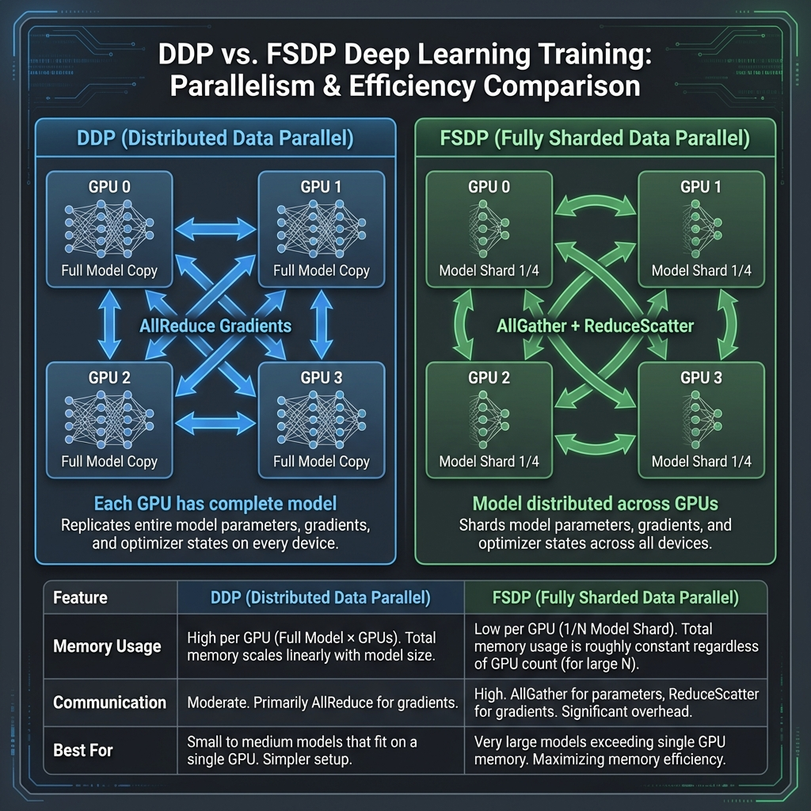

# DDP vs FSDP: 分布式训练策略选择指南

> **TL;DR**: 模型能放进单卡内存 → 用 **DDP**；模型放不下 → 用 **FSDP**

---

## 📊 一图看懂区别

<div align="center">



</div>

<details>
<summary>📝 文字版 (无障碍访问)</summary>

```
DDP (Distributed Data Parallel):
- 每个 GPU 存储完整模型副本
- 通信: AllReduce 梯度同步
- 内存: 每卡需要完整模型 + 梯度 + 优化器状态

FSDP (Fully Sharded Data Parallel):
- 每个 GPU 只存储模型分片 (1/N)
- 通信: AllGather 获取参数 + ReduceScatter 分发梯度
- 内存: 每卡仅需 1/N 的模型 + 梯度 + 优化器状态
```
</details>

---

## 🎯 快速决策表

| 场景 | 推荐策略 | 原因 |
|:-----|:---------|:-----|
| 模型 < 单卡显存 | **DDP** | 开销低，速度快 |
| 模型 > 单卡显存 | **FSDP** | 分片存储，能跑起来 |
| 7B 参数模型 | **DDP** (A100 80GB) 或 **FSDP** (24GB) | 取决于显卡大小 |
| 13B-70B 参数 | **FSDP** | 必须分片 |
| 70B+ 参数 | **FSDP + CPU Offload** 或 **DeepSpeed** | 极限优化 |
| 追求最快速度 | **DDP** | 通信开销最小 |
| 追求最大模型 | **FSDP** | 内存效率最高 |

---

## 📈 性能对比

### 内存使用

| 组件 | DDP | FSDP (Full Shard) |
|:-----|:----|:------------------|
| 模型参数 | N × params | params / N |
| 梯度 | N × grads | grads / N |
| 优化器状态 | N × optim | optim / N |
| **总内存** | **~3× params** | **~3× params / N** |

> N = GPU 数量

**示例 (8 GPU, 7B 模型)**:
- DDP: 每卡需要 ~42GB (不可行 on 24GB GPU)
- FSDP: 每卡需要 ~5.3GB ✅

### 通信开销

| 操作 | DDP | FSDP |
|:-----|:----|:-----|
| Forward | 无 | AllGather |
| Backward | AllReduce (一次) | AllGather + ReduceScatter |
| 复杂度 | O(1) 次通信 | O(层数) 次通信 |

**结论**: DDP 通信更少，FSDP 换取了内存效率

---

## 💡 核心原理

### DDP 工作原理

```python
# 伪代码
for batch in shard(data, world_size):
    output = model(batch)           # 每卡独立前向
    loss = criterion(output)
    loss.backward()                  # 每卡独立反向
    
    all_reduce(gradients)            # 🔄 同步梯度
    optimizer.step()                 # 每卡独立更新
```

**关键点**:
- 每张卡有完整的模型副本
- 数据并行，每卡处理不同 batch
- `AllReduce` 同步梯度后独立更新

### FSDP 工作原理

```python
# 伪代码
for batch in shard(data, world_size):
    for layer in model.layers:
        all_gather(layer.params)     # 🔄 临时获取完整参数
        output = layer(input)
        release(full_params)          # 释放，只保留分片
    
    for layer in reversed(model.layers):
        all_gather(layer.params)     # 🔄 再次获取
        grads = backward(layer)
        reduce_scatter(grads)        # 🔄 分发梯度分片
        release(full_params)
    
    optimizer.step()                 # 只更新本地分片
```

**关键点**:
- 参数/梯度/优化器状态都被分片
- Forward/Backward 时动态 AllGather
- 用通信换内存

---

## 🛠️ 代码示例

### DDP 完整示例

```python
import torch
import torch.distributed as dist
from src.training import DDPWrapper, DDPConfig, setup_distributed, cleanup_distributed

def train_ddp():
    # 初始化分布式环境
    setup_distributed()
    
    # 创建模型
    model = MyModel()
    
    # DDP 配置
    config = DDPConfig(
        mixed_precision=True,
        precision="bf16",
        gradient_clipping=1.0,
        gradient_accumulation_steps=1,
    )
    
    # 包装模型
    wrapper = DDPWrapper(config)
    model = wrapper.wrap(model)
    
    # 优化器
    optimizer = torch.optim.AdamW(model.parameters(), lr=1e-4)
    
    # 数据加载器（需要 DistributedSampler）
    from torch.utils.data.distributed import DistributedSampler
    sampler = DistributedSampler(dataset)
    dataloader = DataLoader(dataset, sampler=sampler, batch_size=32)
    
    # 训练循环
    for epoch in range(num_epochs):
        sampler.set_epoch(epoch)  # 重要！确保 shuffle 正确
        
        for batch in dataloader:
            batch = batch.to(wrapper.device)
            
            with wrapper.autocast():
                loss = model(batch)
            
            wrapper.backward(loss, optimizer, model)
    
    # 保存检查点
    wrapper.save_checkpoint(model, optimizer, epoch, "checkpoint.pt")
    
    cleanup_distributed()

# 运行: torchrun --nproc_per_node=4 train.py
```

### FSDP 完整示例

```python
import torch
from src.training import (
    FSDPWrapper, FSDPConfig, 
    setup_distributed, cleanup_distributed,
    save_fsdp_checkpoint, load_fsdp_checkpoint,
)

def train_fsdp():
    setup_distributed()
    
    model = MyLargeModel()  # 假设是 7B+ 参数
    
    # FSDP 配置
    config = FSDPConfig(
        sharding_strategy="full_shard",     # 完全分片
        mixed_precision=True,
        precision="bf16",
        activation_checkpointing=True,      # 进一步省内存
        auto_wrap_policy="transformer",     # 按 Transformer 层包装
        transformer_layer_cls={TransformerBlock},
        cpu_offload=False,                  # 需要更多内存时开启
    )
    
    # 包装模型
    wrapper = FSDPWrapper(config)
    model = wrapper.wrap(model)
    
    # 优化器（必须在 FSDP 包装后创建）
    optimizer = torch.optim.AdamW(model.parameters(), lr=1e-4)
    
    # 训练循环
    for epoch in range(num_epochs):
        for batch in dataloader:
            optimizer.zero_grad()
            
            loss = model(batch)
            loss.backward()
            
            # FSDP 专用梯度裁剪
            model.clip_grad_norm_(1.0)
            
            optimizer.step()
    
    # 保存检查点（FSDP 需要特殊处理）
    save_fsdp_checkpoint(model, optimizer, epoch, "checkpoint.pt")
    
    cleanup_distributed()

# 运行: torchrun --nproc_per_node=8 train.py
```

---

## ⚠️ 常见陷阱

### DDP 陷阱

| 问题 | 原因 | 解决方案 |
|:-----|:-----|:---------|
| 每个 GPU 输出相同结果 | 忘记用 DistributedSampler | 使用 DistributedSampler |
| 每个 epoch 数据相同 | 忘记 set_epoch | `sampler.set_epoch(epoch)` |
| 模型参数不同步 | 忘记同步随机种子 | 在 DDP 包装前设置相同 seed |
| OOM | 模型太大 | 换 FSDP |

### FSDP 陷阱

| 问题 | 原因 | 解决方案 |
|:-----|:-----|:---------|
| 保存/加载失败 | state_dict 类型错误 | 使用 `save_fsdp_checkpoint` |
| 速度很慢 | 包装粒度太细 | 调整 `min_num_params` |
| torch.compile 报错 | 不兼容 | 设置 `use_orig_params=True` |
| CPU 内存爆炸 | rank0_only 保存 | 使用 sharded 保存 |

---

## 🔧 配置调优

### DDP 最佳实践

```python
DDPConfig(
    # 基础设置
    mixed_precision=True,
    precision="bf16",           # 比 fp16 更稳定
    
    # 性能优化
    static_graph=True,          # 固定计算图，更快
    gradient_as_bucket_view=True,  # 减少内存复制
    
    # 梯度设置
    gradient_clipping=1.0,
    gradient_accumulation_steps=4,  # 模拟更大 batch
    
    # 高级选项
    find_unused_parameters=False,  # 有未使用参数时设为 True
    broadcast_buffers=True,
)
```

### FSDP 最佳实践

```python
FSDPConfig(
    # 分片策略
    sharding_strategy="full_shard",    # 最省内存
    # sharding_strategy="shard_grad_op", # 仅分片梯度，更快
    
    # 精度
    mixed_precision=True,
    precision="bf16",
    
    # 包装策略
    auto_wrap_policy="transformer",
    transformer_layer_cls={TransformerBlock},
    # 或使用 size-based
    # auto_wrap_policy="size",
    # min_num_params=100_000_000,
    
    # 内存优化
    activation_checkpointing=True,     # 省 40-60% 内存
    cpu_offload=False,                 # 极限压缩时开启
    
    # 性能
    backward_prefetch="backward_pre",  # 预取优化
    forward_prefetch=True,
    limit_all_gathers=True,
    
    # torch.compile 兼容
    use_orig_params=True,
)
```

---

## 📊 性能基准

### 测试环境

- 模型: LLaMA-7B
- 硬件: 8 × A100 80GB, NVLink
- Batch Size: 8 per GPU

### 结果

| 配置 | 吞吐量 (tokens/s) | 内存/卡 | 备注 |
|:-----|:-----------------:|:-------:|:-----|
| DDP | 12,000 | 65 GB | 最快 |
| FSDP (no AC) | 10,500 | 28 GB | 平衡 |
| FSDP + AC | 8,500 | 18 GB | 最省内存 |
| FSDP + Offload | 3,200 | 12 GB | 可用于小卡 |

> AC = Activation Checkpointing

---

## 🚀 进阶话题

### 混合策略

```python
# Hybrid Sharding: 节点内 FSDP，节点间 DDP
config = FSDPConfig(
    sharding_strategy="hybrid_shard",  # PyTorch 2.0+
)
```

### 与 torch.compile 结合

```python
# 方案 1: 先 compile 再 FSDP
model = torch.compile(model)
model = FSDPWrapper(config).wrap(model)

# 方案 2: FSDP 包装后 compile（需要 use_orig_params=True）
model = FSDPWrapper(FSDPConfig(use_orig_params=True)).wrap(model)
model = torch.compile(model)
```

### 自动选择策略

```python
from src.training import auto_select_strategy, estimate_memory_usage

# 估算内存需求
estimates = estimate_memory_usage(model, batch_size=8)
print(f"预估需要: {estimates['total_gb']:.1f} GB / GPU")

# 自动选择
strategy = auto_select_strategy(
    model,
    available_gpus=8,
    gpu_memory_gb=24.0,
)
print(f"推荐策略: {strategy}")
```

---

## 📚 参考资料

- [PyTorch DDP Tutorial](https://pytorch.org/tutorials/intermediate/ddp_tutorial.html)
- [PyTorch FSDP Tutorial](https://pytorch.org/tutorials/intermediate/FSDP_tutorial.html)
- [FSDP Paper: ZeRO](https://arxiv.org/abs/1910.02054)
- [本项目示例](../examples/ddp_fsdp_training.py)

---

<div align="center">

**快速记忆**: 能 DDP 就 DDP，不行再 FSDP 🚀

</div>
